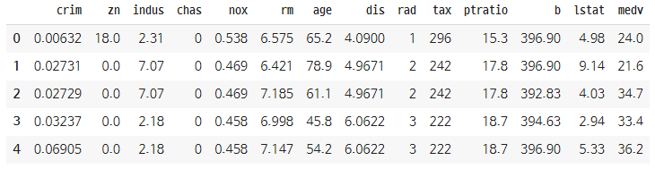
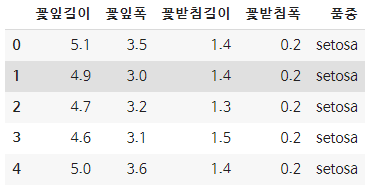

# Pandas

### 제일 먼저 해야 할 일

```python
# 가장 먼저 판다스를 불러와야한다.
import pandas as pd
```


### 파일들로부터 데이터를 읽어온다.

```python
file = 'https://raw.githubusercontent.com/blackdew/tensorflow1/master/csv/lemonade.csv'
lemonadedata = pd.read_csv(file)

file = 'https://raw.githubusercontent.com/blackdew/tensorflow1/master/csv/boston.csv'
boston = pd.read_csv(file)

file = 'https://raw.githubusercontent.com/blackdew/tensorflow1/master/csv/iris.csv'
iris = pd.read_csv(file)
```


### 데이터 모양으로 확인하기

```python
print(lemonadedata.shape)	# (6, 2)
print(boston.shape)			# (506, 14)
print(iris.shape)			# (150, 5)
```


### 칼럼(범주?) 이름 출력하기

```python
print(lemonadedata.columns)
print(boston.columns)
print(iris.columns)

# 레모네이드 칼럼 --> Index(['온도', '판매량'], dtype='object')
# boston 칼럼 --> Index(['crim', 'zn', 'indus', 'chas', 'nox', 'rm', 'age', 'dis', 'rad', 'tax', 'ptratio', 'b', 'lstat', 'medv'], dtype='object')
# iris 칼럼 --> Index(['꽃잎길이', '꽃잎폭', '꽃받침길이', '꽃받침폭', '품종'], dtype='object')

```


### 독립, 종속 변수 설정하기

```python
독립 = lemonadedata[['온도']]
종속 = lemonadedata[['판매량']]
print(독립.shape, 종속.shape)		# (6, 1) (6, 1)

독립 = boston[['crim', 'zn', 'indus', 'chas', 'nox', 'rm', 'age', 'dis', 'rad', 'tax', 'ptratio', 'b', 'lstat']]
종속 = boston[['medv']]
print(독립.shape, 종속.shape)		# (506, 13) (506, 1)

독립 = iris[['꽃잎길이', '꽃잎폭', '꽃받침길이', '꽃받침폭']]
종속 = iris[['품종']]
print(독립.shape, 종속.shape)		# (150, 4) (150, 1)
```


### 각 데이터의 상위 5개만 보기

```python
lemonadedata.head() #lemonadedat의 표 상위 5개만 출력하는 판다스의 메쏘드

'''
	온도	판매량
0	 20	  40
1	 21	  42
2	 22	  44
3	 23	  46
4	 24	  48
'''
```


```python
boston.head()
```




```python
iris.head()
```



