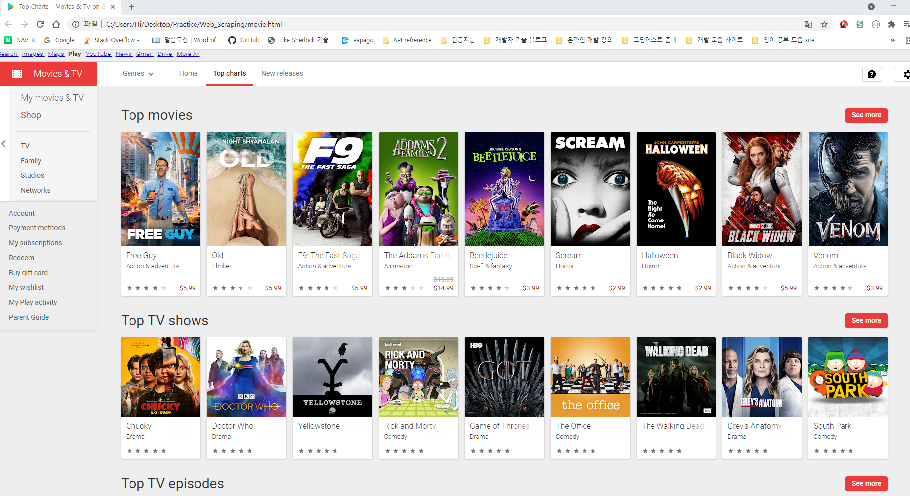

# 활용1. 네이버 항공권 정보 가져오기

```python
from selenium import webdriver
browser = webdriver.Chrome()

# 브라우저 창 최대화
browser.maximize_window()

# 우리가 접속할 url
url = 'https://flight.naver.com/'

# 위 url로 이동
browser.get(url)

# 브라우저에 적혀있는 글씨로 element 선택
# 원래는 아래 text로 찾아야 하는데 오류가 나서 xpath로 도전
# browser.find_element_by_link_text('가는 날').click()
browser.find_element_by_xpath('//*[@id="__next"]/div/div[1]/div[4]/div/div/div[2]/div[2]/button[1]').click()

# 23일을 선택하려고 하는데 23이라는 숫자가 많다.
# 그래서 전체 다 불러온다음에 인덱스로 내가 원하는 날짜 선택하자
# 원래는 아래 방식이 돼야 하지만 안되는거 보니 text로 불러 오는게 문제가 있는 듯
browser.find_elements_by_link_text('23')[0].click() # ==> 이번달
browser.find_elements_by_link_text('25')[0].click() # ==> 이번달

browser.find_elements_by_link_text('23')[0].click() # ==> 이번달
browser.find_elements_by_link_text('25')[1].click() # ==> 다음달
```


> - selenium으로 브라우저 탐색하면서 로딩이 긴 경우 대처하는 방법

```python
from selenium import webdriver
# 아래 라이브러리 추가
from selenium.webdriver.common.by import By
from selenium.webdriver.support.ui import WebDriverWait
from selenium.webdriver.support import expected_conditions as EC

# 로딩 중 화면일 때 조치
# WebDriverWait를 통해서 최대 10초를 기다린다.
# xpath를 조건으로 줄건데 이 조건을 반영해줄때까지 기다리고, 이 조건이 나오면 바로 진행한다.
element = WebDriverWait(browser, 10).untill(EC.presence_of_element_located((By.XPATH,'//*[@id="_flight_section"]/div/div[2]/div[2]/div[1]/div[2]/div/h4/a/span[1]')))

```


# 활용2. 구글 무비에서 영화 정보 가져오기

```python
import requests
from bs4 import BeautifulSoup

url = 'https://play.google.com/store/movies/top'
res = requests.get(url)
res.raise_for_status()
soup = BeautifulSoup(res.text, 'lxml')

movie = soup.find_all('div', attrs={'class':'ImZGtf mpg5gc'})
print(len(movie)) # 0 ==> 제대로 안가져 온다.
```


> - soup 객체가 우리가 원하는 정보를 제대로 안주는거 같을 때, html 문서로 바꿔서 확인해보자.

```python
with open('movie.html', 'w', encoding='utf8') as f:
    f.write(soup.prettify()) # ==> html 문서 텍스트를 문법에 맞게 예쁘게 반환해주는 메써드
    
# 생성한 movie.html 파일을 열어보면 외국 링크로 반환해준 듯 하다
```




> - 이는 우리의 user-agent 정보가 제대로 전달이 안되서, default 값인 영어 html 정보를 반환해준 것 같다.
> - 해결하기 위해 우리의 `user-agent` 와 `accept-language` 를 입력해주자.

```python
import requests
from bs4 import BeautifulSoup

url = 'https://play.google.com/store/movies/top'

# headers 정보
headers = {
    'User-Agent' : 'Mozilla/5.0 (Windows NT 10.0; Win64; x64) AppleWebKit/537.36 (KHTML, like Gecko) Chrome/95.0.4638.54 Safari/537.36',
    'Accept-Language':'ko-KR,ko' # ==> 이렇게 입력하면 한국어 사이트를 반환해준다.
}

res = requests.get(url, headers=headers)
res.raise_for_status()
soup = BeautifulSoup(res.text, 'lxml')

movies = soup.find_all('div', attrs={'class':'ImZGtf mpg5gc'})
print(len(movies)) # 10 ==> 잘 가져 온다.

# 영화 제목만 뽑기
for movie in movies:
    # 텍스트를 바로 가져 오기
    title = movie.find('div', attrs={'class':'WsMG1c nnK0zc'}).get_text()
    print(title)
    
'''
베놈   Venom
Free Guy
올드
블랙 위도우
분노의 질주: 더 얼티메이트
모가디슈
정글 크루즈
날씨의 아이 (자막)
너의 이름은. (자막판)
보스 베이비 2
'''
```


> - 영화정보는 잘 가져 오는데, 10개만 가져온다.
> - 지금 크롤링하려는 구글 무비 페이지는 동적 웹페이지이다.
> - Selenium을 통해 동적 페이지에서 가져오지 못한 정보를 가져오겠다.

```python
from selenium import webdriver
import time

url = 'https://play.google.com/store/movies/top'

browser = webdriver.Chrome()
browser.maximize_window()
browser.get(url) # 페이지 이동

# 지정한 위치로 스크롤 내리기
# 모니터 해상도 숫자를 기준으로 해당 높이만큼 1080만큼 스크롤 내리기
# browser.execute_script('window.scrollTo(0,1080)')
# 만약 맨 위로 옮기로 싶으면 ==> browser.execute_script('window.scrollTo(0,0)')

# 2초에 한번씩 스크롤 내릴 거임
interval = 2

# 화면 가장 아래로 스크롤 내리기위해 현재 문서에서 스크롤 높이만큼 움직여준다.
# 문서 다 내렸을 때 높이
prev_height = browser.execute_script('return document.body.scrollHeight')

# 스크롤 가장 아래로 내리기
while True:

    # 가장 아래로 내리기
    browser.execute_script('window.scrollTo(0, document.body.scrollHeight)')

    # 로딩 대기
    time.sleep(interval)

    # 현재 높이
    curr_height = browser.execute_script('return document.body.scrollHeight')

    # 이전 높이와 현재 높이 같은지 다른지 확인
    # 같으면 여기가 맨 마지막 페이지니깐 그만
    if curr_height == prev_height :
        break
    
    # 그러지 않다면 스크롤 높이를 갱신해주고 while문 반복할 수 있도록
    prev_height = curr_height

print('스크롤 내리기 완료')
```


