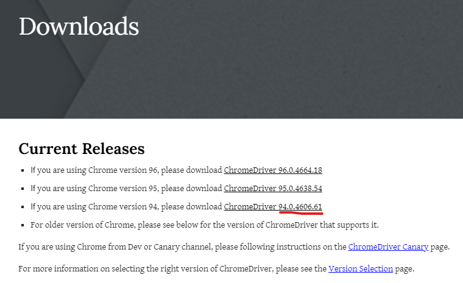
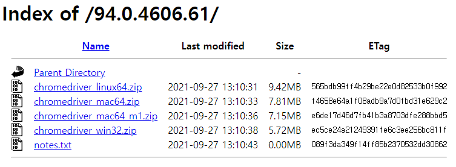

# Selenium

> - 웹페이지 테스트 자동화 프레임워크
> - 웹브라우저 정보를 좀 더 역동적으로 가져와서


### selenium 설치

```cmd
pip install selenium
```

> - `웹드라이버`도 함께 설치해줘야 한다.
> - 우리는 크롬 브라우저를 사용할 예정이어서 우리의 크롬 버전을 확인하고 그 버전과 호환되는 웹드라이버를 설치해야 한다


#### 크롬버전 확인하기

> - 브라우저 주소 창에 `chrome://version` 입력


#### 크롬 웹드라이버 설치

> - 구글에서 `chromdriver` 검색


> - 첫번째 링크 클릭
> - 나의 크롬버전과 동일한 드라이버 선택



> - 나의 운영체제에 맞는 파일 다운



> - 압축 파일 안에는 `chrome.exe` 파일 있는데 이걸 현재 작업하는 폴더에 넣어도 되고, 원하는 위치에 풀어놓기


## Selenium 기본

### 1. first

```python
# 라이브러리
from selenium import webdriver

# webdriver 객체 생성
# 크롬 웹드라이버가 있는 경로를 매개변수로 입력.
# 만약 현재 실행하는 폴더 안에 같이 있다면 입력 안해도 됨
browser = webdriver.Chrome('./chromedriver.exe')

# 크롤링할 웹 주소 가져오기
browser.get('http://naver.com')

# 로그인 버튼 가져오기
# 로그인 element 객체 생성
element = browser.find_element_by_class_name('link_login')

# element 변수 안에 로그인 버튼 엘리먼트인 selenium 객체가 정의돼 있다
element # ==> <selenium.webdriver.remote.webelement.WebElement (session="50abbe2c7c5ab4fde6d1bf1076b728b1", element="7297fba6-f848-44e0-a34d-7836cf5485d6")>

# 로그인 버튼 클릭하기
element.click()

# 브라우저에서 뒤로 가기
browser.back()
# 앞으로 가기
browser.forward()
# 새로고침
browser.refresh()

# 검색창 element 찾기
search = browser.find_element_by_id('query')

# 검색창에 검색어 적기
search.send_keys('파이썬')

# 검색어 입력을 위한 라이브러리 
from selenium.webdriver.common.keys import Keys
# 검색어 입력
search.send_keys(Keys.ENTER)
```


### 2. second

```python
# selenium 객체에서 a tag만 가져오기
atag = browser.find_element_by_tag_name('a')

# 위 코드는 여러 a tag 중에서 맨 처음 하나만 가져오는 것 같다. 전체 다 가져오고 싶을때는
# elements만 바꿔주면 된다.
atags = browser.find_elements_by_tag_name('a')

# 그럼 전체 다 가져왔으니 하나씩 가져와서 href 속성만 출력하려면
for tag in atags:
    tag.get_attribute('href')

  
## Xpath로 클릭하기  
    
# 다음으로 넘어가서
brower.get('http://daum.net')

# name 속성을 활용해서 검색창에 입력
search = browser.find_element_by_name('q')
search.send_keys('파이썬')

# Keys.ENTER를 활용할 수 있지만, 검색버튼을 가져와서 그걸 클릭해보자
# Xpath로 가져와보기
button = browser.find_element_by_xpath('//*[@id="daumSearch"]/fieldset/div/div/button[2]')
button.click()

# 브라우저창에서 tab 하나만 닫고 싶으면
browser.close()

# 전체 다 종료하고 싶으면
browser.quit()
```

