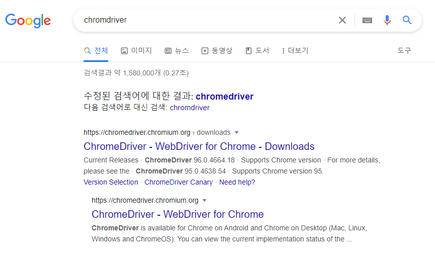

# Selenium

> - 웹페이지 테스트 자동화 프레임워크
> - 웹브라우저 정보를 좀 더 역동적으로 가져와서


### selenium 설치

```cmd
pip install selenium
```

> - `웹드라이버`도 함께 설치해줘야 한다.
> - 우리는 크롬 브라우저를 사용할 예정이어서 우리의 크롬 버전을 확인하고 그 버전과 호환되는 웹드라이버를 설치해야 한다


#### 크롬버전 확인하기

> - 브라우저 주소 창에 `chrome://version` 입력


#### 크롬 웹드라이버 설치

> - 구글에서 `chromdriver` 검색



> - 첫번째 링크 클릭
> - 나의 크롬버전과 동일한 드라이버 선택


> - 나의 운영체제에 맞는 파일 다운


> - 압축 파일 안에는 `chrome.exe` 파일 있는데 이걸 현재 작업하는 폴더에 넣어도 되고, 원하는 위치에 풀어놓기


## Selenium 코드 실행

```python
# 라이브러리
from selenium import webdriver

# webdriver 객체 생성
# 크롬 웹드라이버가 있는 경로를 매개변수로 입력.
# 만약 현재 실행하는 폴더 안에 같이 있다면 입력 안해도 됨
browser = webdriver.Chrome('./chromedriver.exe')

# 크롤링할 웹 주소 가져오기
browser.get('http://naver.com')
```

