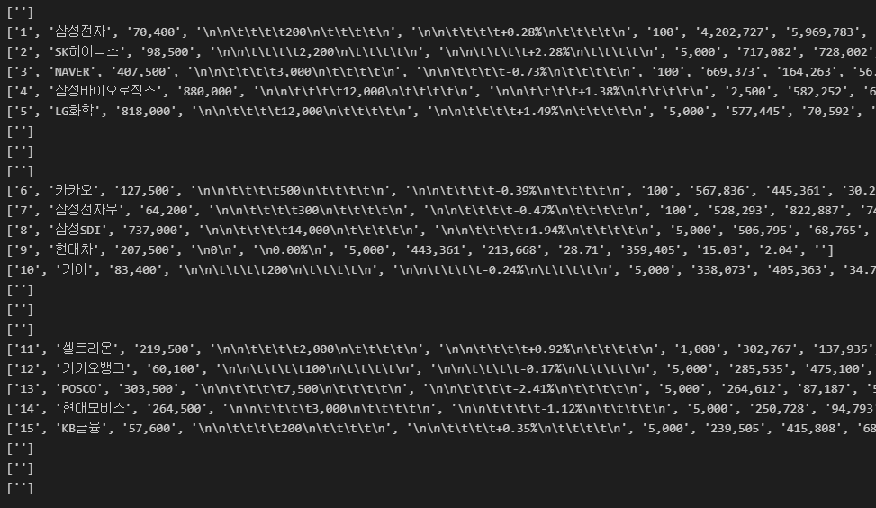

# 네이버 금융 웹스크래핑

> - 네이버금융에서 에서 코스피 시가총액 순위 스크래핑
> - 스크래핑한 데이터를 CSV 파일로 저장하기
> - 이번 스크래핑에서는 url 구조 중 `table`로 구성돼 있고 동일한 tag들이 다양하게 분포돼 있을 때, 상위 분류할 수 있는 tag명을 활용해 스크래핑한다.

```python
import csv
import requests
from bs4 import BeautifulSoup

# 네이버 시가총액 정보가 있는 url
url = 'https://finance.naver.com/sise/sise_market_sum.nhn?sosok=0&page='

# 4 page 까지 스크래핑
for page in range(1,5):
    res = requests.get(url + str(page))
    res.raise_for_status()
    soup = BeautifulSoup(res.text, 'lxml')
    
    # tag가 table이면서 class가 type_2 인 엘리먼트 중 tbody tag를 찾고 거기서 모든 tr tag를 가져온다
    # 그럼 각각의 tr tag안에 정보들이 리스트 형식으로 데이터를 가져올 것이다.
    data_rows = soup.find('table', attrs={'class':'type_2'}).find('tbody').find_all('tr')
    # 한 줄 한 줄 확인하기 위해
    for row in data_rows:
        columns = row.find_all('td') # ==> tr tag 밑에는 td 엘리먼트 안에 각 정보가 들어있다.
        data = [column.get_text() for column in columns]
        print(data)
```



---

> - 출력 하면 위 이미지와 같이 빈 값과 `\n,\t`와 같은 필요없는 공백 정보도 함께 나온다.
> - 이를 제거하기 위해 우선, `tr` tag 중에에 `td` tag가 1개인 엘리먼트는 공백인것을 확인할 수 있었다. ==> 그래서 이는 `if`문과 `continue`를 사용해서 걸러내고
> - `\n`과 `\t`는 공백이기에 `strip()` 함수를 활용해서 제거하자

```python
import csv
import requests
from bs4 import BeautifulSoup

# 네이버 시가총액 정보가 있는 url
url = 'https://finance.naver.com/sise/sise_market_sum.nhn?sosok=0&page='

# 4 page 까지 스크래핑
for page in range(1,5):
    res = requests.get(url + str(page))
    res.raise_for_status()
    soup = BeautifulSoup(res.text, 'lxml')
    
    # tag가 table이면서 class가 type_2 인 엘리먼트 중 tbody tag를 찾고 거기서 모든 tr tag를 가져온다
    # 그럼 각각의 tr tag안에 정보들이 리스트 형식으로 데이터를 가져올 것이다.
    data_rows = soup.find('table', attrs={'class':'type_2'}).find('tbody').find_all('tr')
    # 한 줄 한 줄 확인하기 위해
    for row in data_rows:
        columns = row.find_all('td') # ==> tr tag 밑에는 td 엘리먼트 안에 각 정보가 들어있다.
        # td tag의 개수가 1개 이하면, 우리에게는 필요없는 정보다
        if len(columns) <= 1:
            continue
        # 가지고 온 text에 .strip() 함수로 양옆 공백 제거하자
        data = [column.get_text().strip() for column in columns]
        print(data)
```

---

> - 위 데이터를 csv 파일로 저장해주자.
> - csv.writer.writerow() 함수는 리스트 형태로 데이터를 받아서 저장한다.

```python
import csv
import requests
from bs4 import BeautifulSoup

# 네이버 시가총액 정보가 있는 url
url = 'https://finance.naver.com/sise/sise_market_sum.nhn?sosok=0&page='

# csv 파일 쓰기
# 쓰기 할 파일 객체 만들기
# newline을 공백으로 줘야 각 row마다 한 칸 안뛰고 바로 다음줄에 정보 입력한다.
f = open('네이버금융_시가총액_Top200.csv', 'w', encoding='utf-8-sig', newline='')

# csv writer 객체 생성
# csv로 생성할 파일을 넣는다.
writer = csv.writer(f)

# 주가 정보를 나타내는 column명, 즉 title을 명시해준다.
# tab으로 구분돼 있다.
# split을 통해 list로 변형하자. ==> csv.writer.writerow() 는 리스트를 값으로 받는다.
title = '순번	종목명	현재가	전일비	등락률	액면가	시가총액	상장주식수	외국인비율	거래량	PER	ROE'.split('\t')
# ==> ['순번', '종목명', '현재가', '전일비', '등락률', '액면가', '시가총액', '상장주식수', '외국인비율', '거래량', 'PER', 'ROE']

# 위 타이틀을 집어 넣어준다.
writer.writerow(title)

# 4 page 까지 스크래핑
for page in range(1,5):
    res = requests.get(url + str(page))
    res.raise_for_status()
    soup = BeautifulSoup(res.text, 'lxml')
    
    # tag가 table이면서 class가 type_2 인 엘리먼트 중 tbody tag를 찾고 거기서 모든 tr tag를 가져온다
    # 그럼 각각의 tr tag안에 정보들이 리스트 형식으로 데이터를 가져올 것이다.
    data_rows = soup.find('table', attrs={'class':'type_2'}).find('tbody').find_all('tr')
    
    # 한 줄 한 줄 확인하기 위해
    for row in data_rows:
        columns = row.find_all('td') # ==> tr tag 밑에는 td 엘리먼트 안에 각 정보가 들어있다.
        
        # td tag의 개수가 1개 이하면, 우리에게는 필요없는 정보다
        if len(columns) <= 1:
            continue
        
        # 가지고 온 text에 .strip() 함수로 양옆 공백 제거하자
        data = [column.get_text().strip() for column in columns]
        
        # 한 줄 한 줄 주가 정보를 csv 파일로 저장하자
        writer.writerow(data)
```


