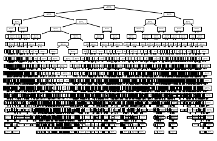

# 결정 트리 (Decision Tree)


> - 결정에 다다르기 위해 예/아니로 질문을 이어 나가면서 학습
> - 스무고개 놀이와 비슷
> - `노드` : 질문이나 정답을 담은 네무 상자
> - `리프` : 마지막 노드 (잎사귀)
> - `에지` : 질문의 답과 다음 질문 연결


## 잘 학습 되었다는 의미는?

#### 정답에 가장 빨리 도달하는 예/아니오 질문 목록을 학습한다는 뜻


## 결정 트리 알고리즘

#### 가능한 모든 테스트에서 타깃값에 대해 가장 많은 정보를 가진 것


## Code

> - 연습 데이터 활용

```python
import pandas as pd

df = pd.read_csv('./210705_이승훈_test.csv')
df

train_data = df.iloc[:,1:-1] # ==> (27930, 32)
train_data = train_data.values

target_data = df.iloc[:, -1:]
target_data = target_data.values.ravel() # ==> (27930,)
```


> - 데이터 분리 및 의사결정나무 모델 생성

```python
from sklearn.tree import DecisionTreeClassifier
from sklearn.model_selection import train_test_split

x_train, x_test, y_train, y_test = train_test_split(train_data, 
                                                    target_data, 
                                                    stratify=target_data, 
                                                    random_state=42)
tree = DecisionTreeClassifier(random_state=0)
tree.fit(x_train, y_train)

print('훈련 세트 정확도: {}'.format(tree.score(x_train, y_train)))
print('테스트 세트 정확도: {:.3f}'.format(tree.score(x_test, y_test)))

'''
훈련 세트 정확도: 1.0
테스트 세트 정확도: 0.851
'''
```

> - 모든 리프 노드가 순수 노드이므로 훈련 세트 정확도 100%
> - 즉, 트리는 훈련 데이터의 모든 레이블을 완벽하게 기억할 만큼 충분히 깊다
> - 결정 트리 깊이 제한하지 않으면 무한정 깊어지고 복잡해진다. 그래서 가지치기 하지 않은 트리는 과대적합되기 쉽고 새로운 데이터에 잘 일반화 되지 않는다.


## 가지치기

> - 일정 깊이에 도달하면 트리의 성장 멈추기 (`max_depth` 설정)

```python
new_tree = DecisionTreeClassifier(max_depth=17, random_state=0)
new_tree.fit(x_train, y_train)

print('훈련 세트 정확도: {:.3f}'.format(new_tree.score(x_train, y_train)))
print('테스트 세트 정확도: {:.3f}'.format(new_tree.score(x_test, y_test)))

'''
훈련 세트 정확도: 0.986
테스트 세트 정확도: 0.856
'''
```


## 트리 시각화

```python
from matplotlib import pyplot as plt
from sklearn.tree import plot_tree
plot_tree(new_tree)
plt.show()
```



