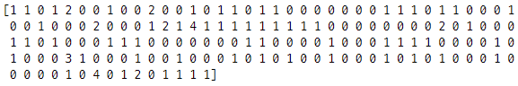

## 라이브러리 모음

```python
import numpy as np
import pandas as pd
import re
from konlpy.tag import Okt
from sklearn.feature_extraction.text import CountVectorizer
from sklearn.feature_extraction.text import TfidfVectorizer
```


## 데이터 불러오기

```python
job_pass = './210712_직무_합불모음.xlsx'
result_pass = pd.read_excel(job_pass, sheet_name=0)
result_nonpass = pd.read_excel(job_pass, sheet_name=1)
```


## 텍스트 전처리 함수

```python
# 특수기호 제거
def text_preprocessing(text):
    sentence = text.split(' ')
    prepro_sentence = []
    for word in sentence:
        prepro_word = re.sub(r'[^ㄱ-ㅎㅏ-ㅣ가-힣0-9a-zA-Z]', '', word)
        prepro_sentence.append(prepro_word)
    result = ' '.join(prepro_sentence)
    return result

# okt 형태소 분석기 토크나이징
def tokenize(text):
    okt = Okt()
    tokens = okt.pos(text, stem=True)
    total_words = []
    for word, tag in tokens:
        if tag not in ['Josa']:
            total_words.append(word)
    result = ' '.join(total_words)
    return result
```


## 데이터 전처리

```python
# 데이터에서 '\n' 없애기
result_pass['의견1_1'] = result_pass['의견1_1'].map(lambda x : x.replace('\n', " "))

# 텍스트 특수기호 제거 후 okt 형태소분석기 활용해서 토크나이징하기
new_test_sentence = []
for text in test[:3]:
    new_test = text_preprocessing(text)
    okt_test = tokenize(new_test)
    new_test_sentence.append(okt_test)
```


## CountVectorizer

```python
count_vect = CountVectorizer()
count_vect.fit(new_test_sentence)
print(count_vect.vocabulary_)
```


## 문장 백터화

```python
print(count_vect.transform([new_test_sentence[1]]).toarray().ravel())
```

