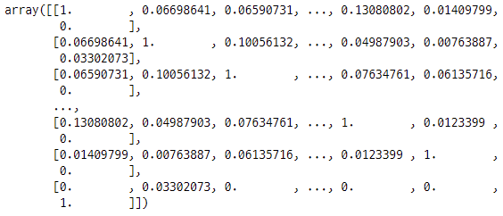

## 라이브러리

```python
import pandas as pd
import numpy as np
import re
from konlpy.tag import Okt
from sklearn.feature_extraction.text import CountVectorizer
from sklearn.feature_extraction.text import TfidfVectorizer
from sklearn.metrics.pairwise import linear_kernel
```


## 데이터불러오기

```python
df_path = './210713_1차.xlsx'
first_pass = pd.read_excel(df_path, sheet_name=0)
first_nonpass = pd.read_excel(df_path, sheet_name=1)
final_pass = pd.read_excel(df_path, sheet_name=2)
final_nonpass = pd.read_excel(df_path, sheet_name=3)
```

```python
sab_path = './210713_2차.xlsx'
first_s = pd.read_excel(sab_path, sheet_name=0)
first_ab = pd.read_excel(sab_path, sheet_name=1)
final_s = pd.read_excel(sab_path, sheet_name=2)
final_ab = pd.read_excel(sab_path, sheet_name=3)
```


## 함수 모음

```python
# 특수기호 제거
def text_preprocessing(text):
    sentence = text.split(' ')
    prepro_sentence = []
    for word in sentence:
        prepro_word = re.sub(r'[^ㄱ-ㅎㅏ-ㅣ가-힣0-9a-zA-Z]', '', word)
        prepro_sentence.append(prepro_word)
    result = ' '.join(prepro_sentence)
    return result

# okt 형태소 분석기
def tokenize(text):
    okt = Okt()
    tokens = okt.pos(text, stem=True)
    total_words = []
    for word, tag in tokens:
        if tag not in ['Josa']:
            total_words.append(word)
    result = ' '.join(total_words)
    return result
```


## 직무합격


### 데이터 전처리

```python
# '\n' 제거
first_pass['의견1_1'] = first_pass['의견1_1'].map(lambda x : x.replace('\n', " "))
# 특수기호 제거
new_first_pass = first_pass['의견1_1'].map(text_preprocessing)
# okt 형태소 분석 (조사 제거 & 어미 변환)
new_first_pass = new_first_pass.map(tokenize)
```


## TF-IDF & Cosine유사도

```python
topic_word = '소통 성장 긍정적 기본적 인재 도전'
tfidf = TfidfVectorizer()
new_text = pd.Series(topic_word)
all_text = new_first_pass.append(new_text)
tfidf_matrix = tfidf.fit_transform(all_text)
cosine_sim = linear_kernel(tfidf_matrix, tfidf_matrix)
cosine_sim
```




### 가장 높은 유사도 확인

```python
cosine_sim[-1][cosine_sim[-1][:-1].argsort()[-1]]
```


### 유사도 Top5 문장 확인

```python
first_pass['의견1_1'][cosine_sim[-1][:-1].argsort()[-1]]
first_pass['의견1_1'][cosine_sim[-1][:-1].argsort()[-2]]
first_pass['의견1_1'][cosine_sim[-1][:-1].argsort()[-3]]
first_pass['의견1_1'][cosine_sim[-1][:-1].argsort()[-4]]
first_pass['의견1_1'][cosine_sim[-1][:-1].argsort()[-5]]
```

