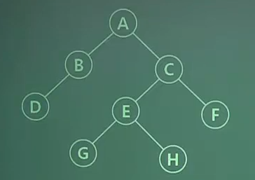

# [이기적 필기 기출] (2020.06.06)

### Q.21 평가 점수에 따른 성적부여는 다음 표와 같다. 이를 구현한 소프트웨어를 경계값 분석 기법으로 테스트 하고자 할 때 다음 중 테스트 케이스의 입력 값으로 옳지 않은 것은?

| 평가 점수 | 성적 |
| :-------: | :--: |
| 80 ~ 100  |  A   |
|  60 ~ 79  |  B   |
|  0 ~ 59   |  C   |

1. 59
2. 80
3. 90
4. 101

#### **`[풀이]`**

`<경계값 테스트 분석>`

> - 에러가 주로 경계값 부근에서 많이 발생하기 때문에 경계값을 평가점수로 부여해서 테스트
> - 범위의 한계 부분을 집중적으로 검사하는 경우를 정하여 검사하는 방법

---

### Q.2 다음 트리의 차수(Degree)와 단말 노드(Terminal Node)의 수는?

1. 차수:4, 단말 노드:4

2. 차수:2, 단말 노드:4

3. 차수:4, 단말 노드:8
4. 차수:2, 단말 노드:8

#### **`[풀이]`**

> - 차수란 자식 노드의 개수
>   - A 차수는 2개 (B,C)
>   - B 차수는 1개 (D)
>   - C 차수는 2개 (E,F)
>   - E 차수는 2개 (G,H)
> - 트리의 차수라고 하면 트리 중에 가장많은 차수를 가지고 있는 수를 의미
> - 단말 노드는 더이상 자식 노드가 없는 것 (D,G,H,F)

---

