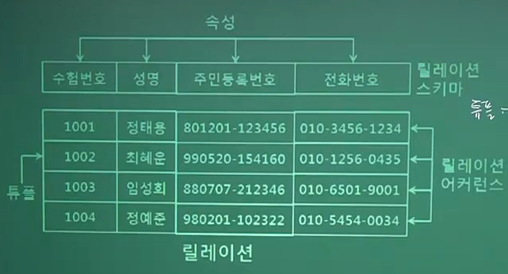

# [이기적 필기 기출] (2020.06.06)

### Q.49 데이터베이스의 `논리적 설계` 단계에서 수행하는 작업 아닌 것은?

1. 레코드 집중의 분석 및 설계

2. 논리적 데이터 베이스 구조로 매핑

3. 트랜잭션 인터페이스 설계
4. 스키마의 평가 및 정제

#### **`[풀이]`**

`<데이터 베이스 설계 순서>`

기획 --> 요구조건분석(개체, 속성, 관계성) --> `개념적` 설계(==현실세계 데이터를 정보 구조로, E-R다이어그램) --> `논리적` 설계(DBMS(관계형), Table, primary key,  개념 스키마설계, 트랜잭션설계) --> `물리적` 설계 --> 구현(실제 데이터 집어 넣는 것) --> 운영 --> 감사, 평가

`<논리적 설계 3단계>`

> 1. 논리적 데이터 모델 변환
> 2. 트랜잭션(사건, 이벤트 발생) 인터페이스 설계
> 3. 스키마 평가 및 최적화

`<물리적 설계 3단계>`

> 1. 레코드 분석 및 설계 (저장 레코드의 형식 설계)
> 2. 클러스터링
> 3. 접근경로

---

### Q.50 E-R 모델의 표현 방법으로 옳지 않은 것

1. 개체타입 : 사각형

2. 관계타입 : 마름모

3. 속성 : 오각형
4. 연결 : 선

#### **`[풀이]`**

속성은 `원` / 오각형은 아예 없다

---

### Q.51 병행 제어의 로킹(Locking) 단위에 대한 설명 옳지 않은 것

1. 데이터베이스, 파일, 레코드 등은 로킹 단위가 될 수 있다.

2. 로킹 단위가 작아지면 로킹 오버헤드가 감소한다

3. 로킹 단위가 작아지면 데이터베이스 공유도가 증가한다
4. 한꺼번에 로킹할 수 있는 객체의 크기를 로킹 단위라고 한다.

#### **`[풀이]`**

> - Locking : DB를 동시에 사용할 수 없는 단위(범위)
>   - 데이터베이스에서 하나의 트랜잭션에 사용하는 데이터를 다른 트랜잭션이 접근하지 못하도록 잠그는 행위
> - Locking의 단위는 얼마만큼 큰 단위로 Lock을 소유하고 풀어줄 것인가의 따라 데이터베이스 성능에 영향 미친다
>   - Locking이 클때 : 관리가 편하다
>   - Locking이 작을때 : 효율적이다
> - 일정한 크기의 `데이터베이스 공유 영역`을 적절한 크기로 분할한 영역을 Locking 단위라고 한다. Locking 단위가 크면 Lock의 수가 줄어들어 병행 제어 기술이 `단순`해지면 병행성 수준이 `낮아진다.`
> - `오버헤드` 란 간접부담비용 (실행하기 위한 준비 과정)

> - 로킹(Locking) 단위는 테이블도 될 수 있고, 필드, 파일, 레코드 다 가능
> - 로킹(Locking) 단위가 작아지면 데이터베이스 공유도가 증가한다.

---

### Q.52 뷰(View)에 대한 설명으로 옳지 않은 것은?

1. 뷰는 CREATE 문을 사용하여 정의한다
2. 뷰는 데이터의 논리적 독립성을 제공한다
3. 뷰를 제거할 때에는 DROP 문을 사용한다
4. 뷰는 저장 장치 내에 물리적으로 존재한다

#### **`[풀이]`**

> - 뷰 테이블 (가상테이블) : 기본 테이블 데이터는 건드릴 수 없고, 사용하고 싶은 데이터만 가져와서(복사) 사용

<특징>

> - 하나 이상의 뷰 테이블은 기본 테이블로부터 유도되어 정의되는 `가상 테이블`이며 뷰 테이블로 정의한 정보는 `시스템 카탈로그`에 저장!
> - 기본 테이블은 실제 테이블이지만 뷰 테이블은 물리적으로 존재하지 않고 또한 물리적으로 분리될 수도 없다.
> - 데이터베이스의 응용프로그램이나 사용자가 접근하는 `외부 스키마`를 구성하는 데 쓰인다.
> - 데이터베이스에 `논리적 데이터 독립성`을 제공할 수 있다.
> - 같은 데이터를 동시에 여러 사용자에게 상이한 방법으로 제공할 수 있다.
> - 뷰는 `여러 사용자`의 상이한 응용이나 요구를 지원할 수 있어서 `데이터 관리를 단순`하게 한다.
> - 제공되지 않은 데이터에 대해서는 `자동적으로 보안`을 유지할 수 있다.

<단점>

> - 한 번 정의되면 변경할 수 없다.
> - 가상 테이블인 뷰 테이블은 추출된 정보를 사용하는 용도
> - 정의된 뷰 테이블의 속성을 변경하려면 기본 테이블의 속성을 변경해야 한다.
> - 뷰 테이블은 ALTER 명령어를 사용할 수 없다.
> - 뷰 테이블은 기본 테이블이 아닌 가상 테이블이기 때문에 삽입, 삭제, 변경에 대한 연산에 많은 제약 사항이 따른다.

---

### Q.53 하나의 애트리뷰트가 가질 수 있는 원자 값들의 집합을 의미하는 것은?

1. 도메인
2. 튜플
3. 엔티티
4. 다형성

#### **`[풀이]`**

<RDBMS 기본 용어>

> - 릴레이션 스키마 : 하나 이상의 속성을 합쳐 정의하는 이름 / 구조
> - 릴레이션 : 데이터를 간 나타내는 표 자체 / 릴레이션 스키마와 릴레이션 어커런스를 겹합한 명칭
> - 튜플 : 한 줄 record
> - 릴레이션 어커런스 : Table 값이 꽉 찼을 때 / 실제 입력된 츄플들의 집함으로 시간에 따라 변화된다.
> - 속성(Attribute) : 하나의 개체(학생)가 가지고 있는 여러 정보(학번, 성명, 주소 ...)
> - 디그리(Degree) : 차수 / 하나의 릴레이션에서 정의된 속성의 개수 / 레코드의 필드 수
> - 카디날리티 : 기수 / 하나의 릴레이션에 형성된 츄플의 개수
> - 도메인 : 힌 속성에 입력되는 실제 값
> - 널(NULL) : 속성 값이 비어 있는 상채 (숫자 0과 공백 문자는 NULL이 아니다)
> - 엔티티 : 개체
> - 다형성 : 오버로딩, 오버라이딩

---

## Q.54 관계대수 연산에서 두 릴레이션이 공통으로 가지고 있는 속성을 이용하여 두 개의 릴레이션을 하나로 합쳐서 새로운 릴레이션을 만드는 연산은?

1. ▷◁
2. ⊃
3. π 
4. σ

#### **`[풀이]`**

<JOIN>

> - 2개의 테이블을 결합해서 새로운 테이블을 만드는
> - 기호는 ▷◁
> - π (파이, 프로젝션) : 특정 칼럼 데이터만 추출
>   - ex) SELECT B,C FROM mytable
> - σ (시그마) : 특정 조건으로 데이터 추출
>   - ex) SELECT * FROM mytable WHERE E >= 90;

---

## Q.55 분산 데이터베이스 목표 중 '데이터베이스의 분산된 물리적 환경에서 특정 지역의 컴퓨터 시스템이나 네트워크에 장애가 발생해도 데이터 무결성이 보장된다'는 것과 관계 있는 것은?

① 장애 투명성

② 병행 투명성

③ 위치 투명성

④ 중복 투명성

#### **`[풀이]`**

<분산 데이터베이스>

> - 데이터베이스를 여러 개의 컴퓨터에 분산 배치하여 관리하는 것
> - 분산 데이터베이스 시스템의 목적은 여러 개로 분산 배치되어 있는 데이터베이스들을 하나의 커다란 데이터베이스처럼 느낄 수 있도록 하는 `투명성` 보장에 목적이 있다.
> - 위치 투명성
>   - 사용자가 물리적으로 분산 저장 되어있는 데이터베이스를 알 필요 없이 논리적인 입장에서 데이터베이스가 모두 자신의 컴퓨터에 있는 것처럼 처리하는 특성
> - 중복 투명성
>   - 접근 횟수가 많은 데이터에 대해서는 각 컴퓨터마다 데이터를 중복시켜 놓고 트랜잭션이 데이터를 중복 사실을 모르는 상태에서도 데이터 처리가 가능하게 하는 특성으로 병목 현상, 즉 부하를 방지하는 특성
> - 병행 투명성
>   - 분산 데이터베이스와 관련된 다수의 트랜잭션들이 동시에 실행되더라도 트랜잭션의 결과에 이상이 없게 하는 특성
> - 장애 투명성
>   - 트랜잭션의 장애, DBMS의 오류, 네트워크 불량, 컴퓨터 장애에도 불구하고 트랜잭션이 수행문제 없이 될 수 있는 특성

---

