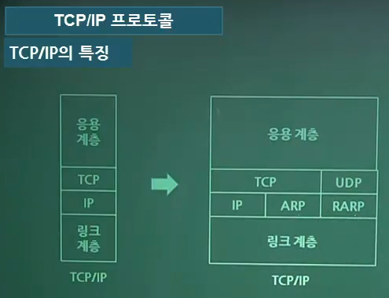

# [이기적 필기 기출] (2020.06.06)

### Q.61 UNIX의 쉘(Shell)에 관한 설명으로 옳지 않은 것은?

1. 명령어 해석기이다.

2. 시스템과 사용자 간의 인터페이스를 담당한다.

3. 여러 종류의 쉘이 있다.
4. 프로세스, 기억 장치, 입출력 관리를 수행한다.

#### **`[풀이]`**

`<Unix 기본 구성>`

> - 커널(Kernel) : 핵심 루틴, 하드웨어 보호기능, 사용자 서비스 제공, 프로세스 `관리`, 메모리 `관리`, 네트워크(통신) `관리`, 입출력 `관리`, 파일 `관리` 기능 ==> 컴퓨터를 운영하기 위한 기본적인 프로그램
> - 쉘(Shell) : 사용자 `명령`의 입력을 받아 시스템 기능을 수행하는 `명령 해석기` / 사용자와 시스템간 `인터페이스`를 담당. 즉, 사용자와 커널 사이에서 `중계자` 역할 or 여러 가지 내장 명령어 보유
> - 유틸리티(Utility) : 메모장, 탐색기, 컴파일러, 네트워크(통신) 같이 간단한 응용 프로그램

---

### Q.62 TCP/IP 프로토콜 중 전송 계층 프로토콜은?

1. HTTP

2. SMTP

3. FTP
4. TCP

#### **`[풀이]`**

`<TCP/IP의 특징>`

> - IP프로토콜 : 해당되는 컴퓨터(서버)까지 접근시키는 역할 즉, IP주소 매칭 / 비연결형 프로토콜(연결이 안 돼 있는 상황에서 연결해줌)
> - ARP 프로토콜 : 논리적(IP주소)인 주소를 가지고 물리적(LAN카드 주소)인 주소를 찾는다.
> - RARP 프로토콜 : 물리적인 주소로 논리적인 주소 찾기
> - TCP : 연결형 프로토콜 / 포트와 연결돼 있는 프로그램까지 연결하는 프로토콜
> - 인터넷 연결을 위한 프로토콜
> - 링크계층, TCP계층(전송계층), IP계층(네트워크 계층), 응용계층(==> SMTP, HTTP, FTP, Telnet)으로 구분
> - TCP는 데이터 전송 프로토콜로 `연결형` 프로토콜
> - IP는 여러 개의 패킷 교환망들의 상호 연결을 위한 범용 `비 연결형` 프로토콜
> - IPv6는 IPv4의 한계로 인해 출현하였다.

