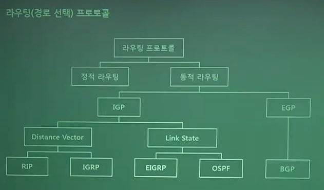

# [이기적 필기 기출] (2020.06.06)

### Q.81 웹과 컴퓨터 프로그램에서 용량이 적은 데이터를 교환하기 위해 데이터 객체를 속성, 값의 쌍 형태로 표현하는 형식으로 자바스크립트를 토대로 개발되어진 형식은

1. Python

2. XML

3. JSON
4. WEB SERVER

#### **`[풀이]`**

`<인터페이스 구현을 위한 도구>`

> - HTML은 정적이다.
> - XML은 HTML의 확장판 (JAVA 기반)
>   - 다른 특수한 목적을 갖는 마크업 언어를 만드는 데 사용하도록 권장하는 다목적 마크업 언어
>   - 다른 많은 종류의 데이터를 기술하는 데 사용될 수 있다.
>   - 다른 종류의 시스템끼리 데이터를 쉽게 주고받을 수 있다.
>   - XML 문서는 문자로 이루어져 있다.
>   - 유니코드 문자는 XML 문서에 나타날 수 있다.
>   - 파서는 마크업을 분석하고 필요한 정보를 추출하여 응용 프로그램에 넘긴다.
>   - XML 문서를 구성하는 문자들은 마크업과 내용으로 구분되며 간단한 문법 규칙으로 이루어진다.
> - JSON(JavaScript Object Notation)
>   - 웹과 컴퓨터 프로그램에서 용량이 적은 데이터를 교환하기 위해 데이터 객체를 속성, 값의 쌍 형태로 표현하는 형식으로 자바스크립트를 토대로 개발되어진 형식
>   - 속성과 값으로 이루어진 데이터 객체를 전달하기 위해 사용하는 개방형 표준 포맷
>   - AJAX에서 많이 사용되고, XML 대체하는 주요 데이터 포맷

---

### Q.82 최대 흡수를 15로 제한한 라우팅 프로토콜은?

1. RIP

2. OSPF

3. Static
4. EIGRP

#### **`[풀이]`**

`<라우팅 프로토콜>`

> - 동적 라우팅 (Dynamic Routing) - IGP(내부 라우팅 프로토콜)
>
>   - Distance Vector
>
>     - RIP
>       - 매트릭을 이용하여 홀카운트를 계산
>       - 최대 홉카운트를 15이하로 제한
>     - IGRP
>       - 미국 시스코에서 만든 프로토콜
>       - 최선의 전송 능력, 전송 지연 시간, 사용률, 신뢰성을 고려하여 라우팅 경로 결정
>       - 90초마다 브로드캐스트
>       - 루프를 방지하기 위해 일정한 시간 경과하기 전에 새로운 정보 들어오면 무시한다
>
>   - Link State
>
>     - 모든 라우팅 테이블에 목적지까지 진행하는 경로를 SPF 알고리즘으로 기록하는 방식
>     - 목적지까지의 모든 경로 정보를 저장
>     - 라우팅 테이블 복잡
>     - 네트워크 변화를 빠르게 감지하여 경로를 재설정
>     - 이웃한 라우터에 대한 정보 , 자른 모든 라우터와 정보 공유
>     - Dijksta 알고리즘 사용
>
>     

